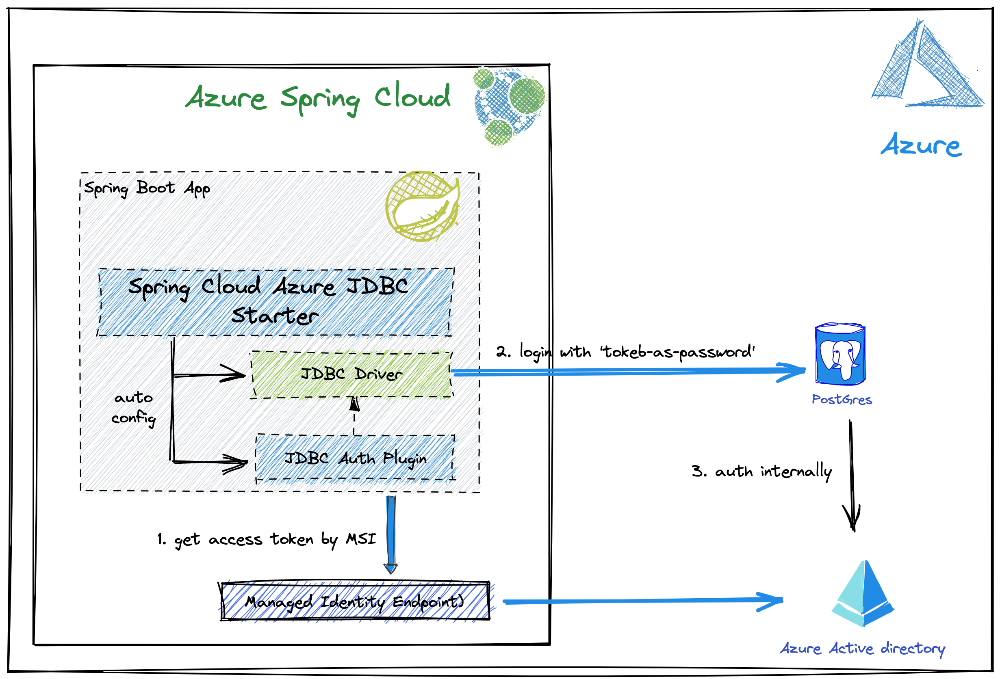

# JEP X: JDBC Authentication Plugin API

```
Authors     TBD
Owner       TBD
Type        Feature
Scope       SE
Status      Draft 
Release     TBD
Component   core-libs
Discussion  jdbc-spec-discuss at openjdk dot java dot net 
Effort      TBD
Duration    TBD
Endorsed by TBD
Created     2022/06/20 20:00 
Updated     2022/06/20 20:00 
Issue       N/A
```

Summary
-------

Define a standard Authentication Plugin interface in the JDBC Specification API,
to allow JDBC drivers to consume from a provided plugin the required
authentication data, such as but not limited to username, password,
authentication tokens, and certificates, to securely connect with databases.

Goals
-----

Define a standard interface in the JDBC API to allow drivers to support
pluggable authentication mechanisms.

Authentication plugins may be provided by the JDBC drivers themselves, or as
external plugins implemented by 3rd-parties, such as managed database service
vendors.

Non-Goals
---------

It is not a goal of this JEP to define different interfaces, nor
implementations, for different authentication mechanisms. These must all be
provided by JDBC drivers or by managed database service vendors.

Motivation
----------

With the advent of software-as-a-service (SaaS) and platform-as-a-service,
vendor-managed relational databases, and the increasing focus in advanced
security and authentication mechanisms on Zero-Trust methodologies, it is
becoming standard practice for applications to connect to databases by using
authentication tokens, managed identity data, certificates, and other techniques
instead of username and password. These techniques can be made available in
different forms, through different methods, and with different policies.

In its latest form, the JDBC API does not offer a standard authentication plugin
interface to allow JDBC drivers and service vendors to integrate these different
authentication methods in a uniform, standard way.

Service providers have started to implement alternatives using non-standard
techniques, often requiring installation or configuration of components and
dependencies in applications, to bypass the current limitation in the JDBC API.
These variable techniques make it difficult for developers to move Java
applications between different SaaaS managed databases, therefore requiring
specific configurations and libraries for each provider.

SaaS vendors themselves end up having to implement database driver specific APIs
("proprietary", but not necessarily closed-source) and maintain these
implementations on a per-database, per-version basis.

Description
-----------

JDBC drivers have started to provide mechanisms to allow managed database
services to plug more secure authentication mechanisms other than username and
password. At the time of this JEP draft, MySQL and PostgreSQL provide
non-standard interfaces.

### Existing databases with Pluggable Authentication

#### **MySQL Connector/J 8.0 (JDBC 4.2)**

Authentication Plugin interface:

 * https://github.com/mysql/mysql-connector-j/blob/release/8.0/src/main/core-api/java/com/mysql/cj/protocol/AuthenticationPlugin.java

Authentication Provider interface:

 * https://github.com/mysql/mysql-connector-j/blob/release/8.0/src/main/core-api/java/com/mysql/cj/protocol/AuthenticationProvider.java 

#### **PostgreSQL (JDBC 4.2)**

Authentication Plugin interface:

 * https://github.com/pgjdbc/pgjdbc/blob/master/pgjdbc/src/main/java/org/postgresql/plugin/AuthenticationPlugin.java

### Existing implementations for authentication plugins

#### **Azure SQL Services**

Authentication Plugin for MySQL:

 * https://github.com/Azure/azure-jdbc-msi-extension/blob/main/jdbc/src/main/java/com/azure/jdbc/msi/extension/postgresql/AzurePostgresqlMSIAuthenticationPlugin.java

Authentication Plugin for PostgreSQL:

 * https://github.com/Azure/azure-jdbc-msi-extension/blob/main/jdbc/src/main/java/com/azure/jdbc/msi/extension/mysql/AzureMySqlMSIAuthenticationPlugin.java

### Architectural Design of Existing Solutions



### Proposal: JDBC 4.4

Therefore, this JEP proposes the inclusion of an AuthenticationPlugin interface
in the JDBC specification, based on the design suggested by the JDBC drivers of
the two most used open source relational databases in the industry, with a basis
on the Azure plugins as examples of implementation and integration with this new
API.

The proposal is to include the following interface:

 * java.sql.AuthenticationPlugin

The proposed interface definition can be found at: _TBD_url_

And the following new methods to existing JDBC APIs:

 * java.sql.Driver.connect(String url, Properties properties, AuthenticationPlugin authPlugin)
 * java.sql.DriverManager.getConnection(String url, AuthenticationPlugin authPlugin);
 * java.sql.DriverManager.getConnection(String url, Properties properties, AuthenticationPlugin authPlugin);
 * java.sql.Connection.getAuthenticationPlugin();
 * java.sql.ConnectionBuilder.authenticationPlugin(AuthenticationPlugin authPlugin);
 * java.sql.PooledConnectionBuilder.authenticationPlugin(AuthenticationPlugin authPlugin);
 * javax.sql.DataSource.getConnection(AuthenticationPlugin authPlugin);
 * javax.sql.XADataSource.getXAConnection(AuthenticationPlugin authPlugin);
 * javax.sql.ConnectionPoolDataSource.getPooledConnection(AuthenticationPlugin authPlugin);
 * javax.sql.XAConnectionBuilder.authenticationPlugin(AuthenticationPlugin authPlugin);

Alternatives
------------

Authentication plugin APIs may continue to be offered as a non-standard,
database driver specific APIs, which implementors may follow common principles
but still require implementations to support multiple interfaces.

JDBC API aims at standardizing common database functionalities. At the moment,
authentication through username and password is the only method designed in the
API. Therefore, standardizing an authentication plugin is preferrable for
consistency across different JDBC drivers.

Testing
-------

Testing for this new interface shall be done by verifying that an application
can establish a connection to a databse by using an environment variable
containing an authentication token. The token may be made available as an
envrionment variable, and read by the authentication plugin.

Risks and Assumptions
---------------------

JDBC drivers that cannot support authentication plugin must explicitly document
such limitation, to prevent assumptions by end-users. This may be done by the
JDBC driver vendor simply indicating that the driver does not support the
version of the JDBC API Specification that contains this interface.

Dependencies
------------

This JEP has no dependencies identified.
